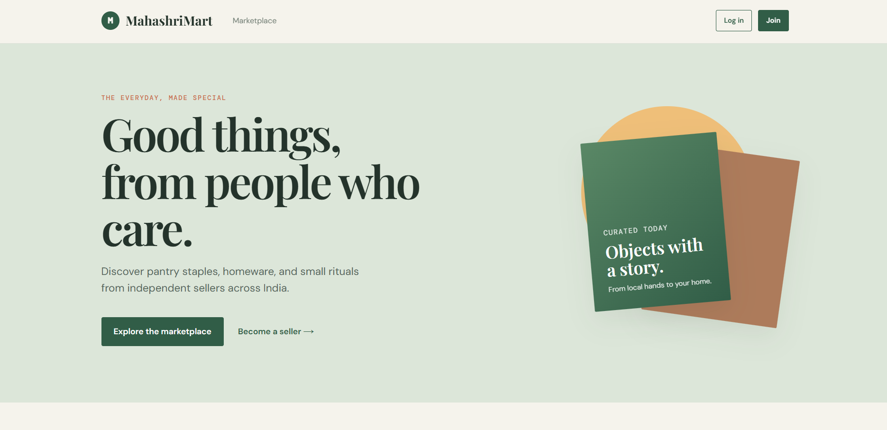
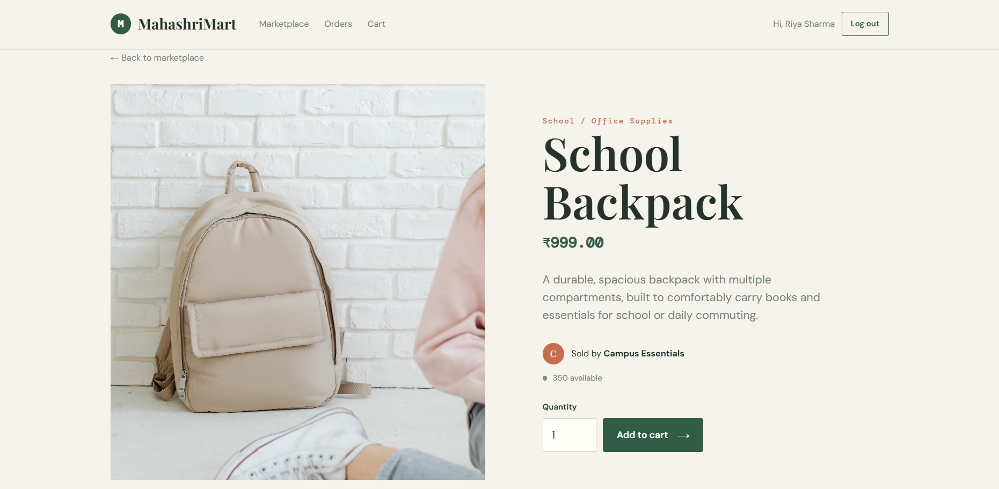
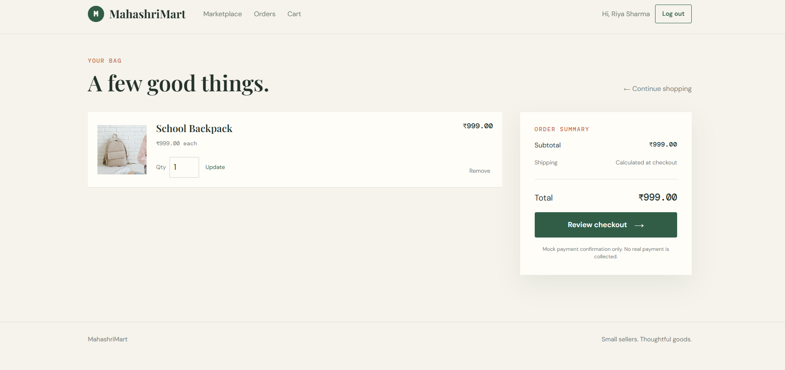
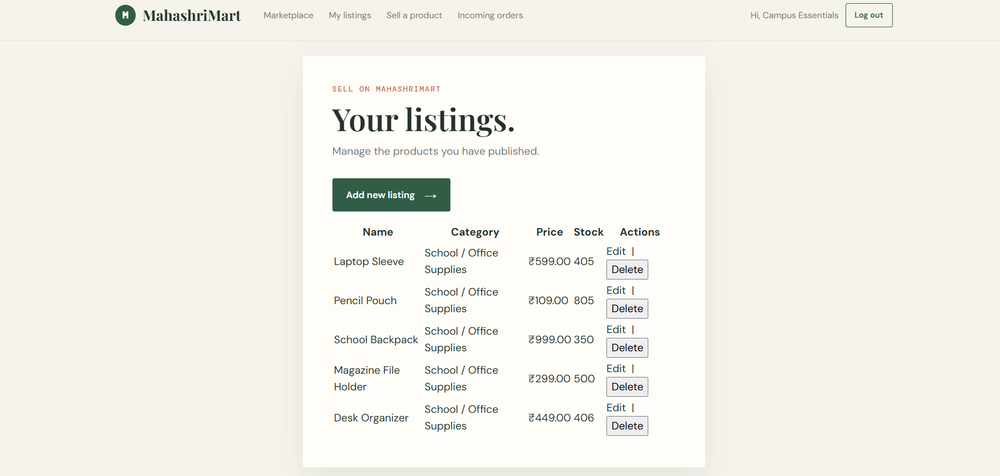
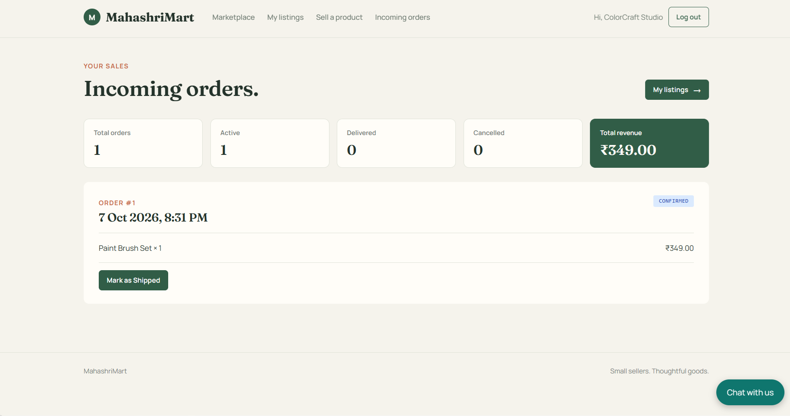
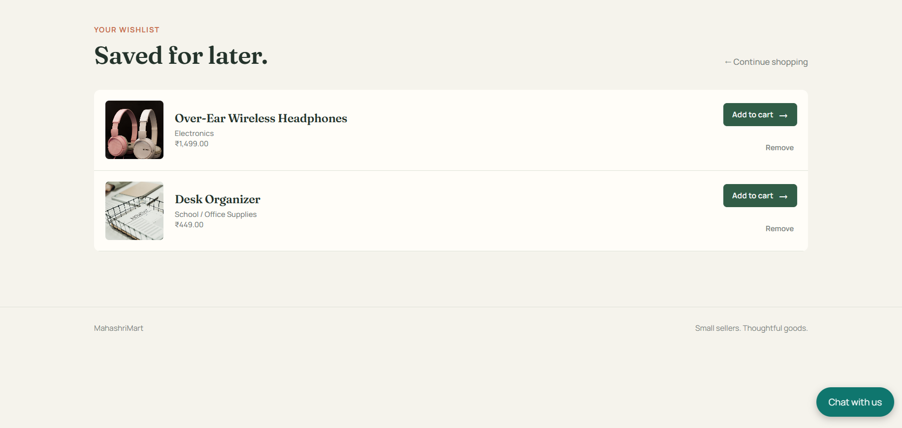
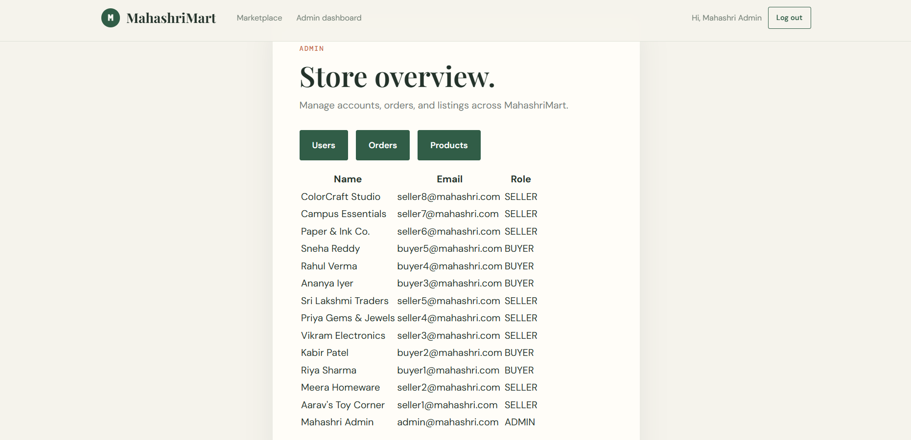
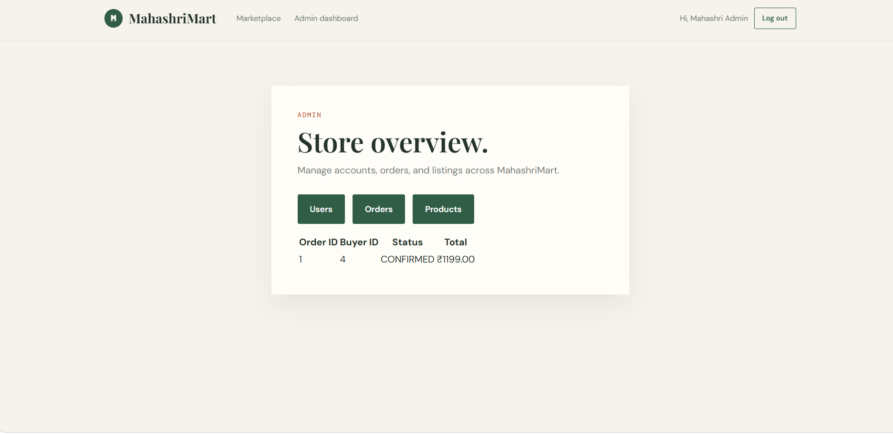
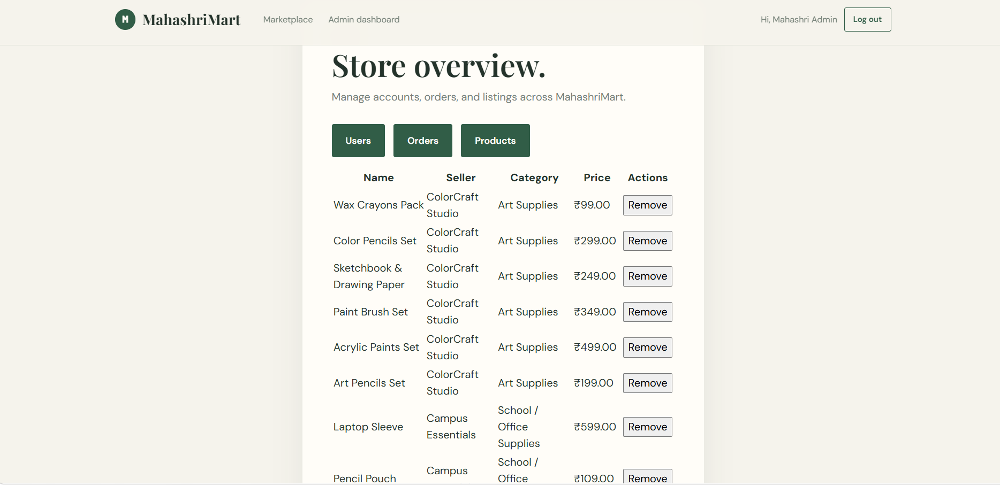

# MahashriMart

MahashriMart is a Java 17 multi-seller marketplace built with Servlets on Tomcat 9, JSP/JSTL, JDBC, H2, and HikariCP.

**Live demo:** https://mahashri-mart.onrender.com

## Features

- **Authentication** - registration and login for buyers, sellers, and an admin seed account, with bcrypt password hashing and session-based auth
- **Product browsing** - search by keyword and filter by category (Toys, Home, Wellness, Electronics, Jewels, Groceries, Stationery, School / Office Supplies, Art Supplies)
- **Cart & checkout** - add/update/remove items, running total, mock payment confirmation
- **Order history** - buyers can view their past orders; sellers can view incoming orders containing their own products
- **Order status workflow (v1.2.0)** - sellers move orders CONFIRMED -> SHIPPED -> DELIVERED; buyers can cancel PENDING/CONFIRMED orders and the stock is restored; admin can set any status and filter orders by status
- **Order timeline and readable dates (v1.3.0)** - buyers see a Confirmed / Shipped / Delivered progress timeline, and order dates are shown in Indian time (for example "4 Oct 2026, 10:17 PM")
- **Seller sales dashboard (v1.3.0)** - sellers see total, active, delivered and cancelled order counts plus total revenue (cancelled orders are not counted)
- **Wishlist / save for later (v1.4.0)** - buyers can save products to a wishlist, move them to the cart, or remove them
- **Seller listings** - sellers can create, edit, and delete their own product listings
- **Admin panel** - view all users, view all orders (with status filter and status update), and moderate/remove any product listing
- **Reviews & ratings** - buyers can leave a 1-5 star rating with an optional comment on any product
- **AI Chatbot** - shopping assistant widget on every page (see below)

## Tech stack

- Java 17, Maven, Apache Tomcat 9.0.x
- Java Servlets (javax.servlet.*), JSP + JSTL
- JDBC with H2 (embedded, in-memory)
- HikariCP connection pooling
- jBCrypt for password hashing
- Gson for JSON serialization
- JUnit 5 + Mockito for unit tests
- Docker (for deployment)
- GitHub Actions (CI - build and test on every push)

## Architecture

Layered MVC over Servlets (Front Controller pattern):

```
Browser (HTML/CSS/JSP)
    |
Filter layer -> AuthFilter (session check), EncodingFilter
    |
Controller layer -> per-resource Servlets (ProductServlet, CheckoutServlet, OrderHistoryServlet,
                     SellerOrdersServlet, AdminServlet, ReviewServlet, WishlistServlet,
                     HealthServlet, ChatServlet, ...)
    |
Service layer -> business logic, validation (OrderService, ProductService, UserService,
                  WishlistService, ChatService, ...)
    |
DAO layer -> ProductDao, OrderDao, CartDao, UserDao, ReviewDao, WishlistDao - all SQL, PreparedStatement only
    |
Connection Pool -> HikariCP (via AppContextListener at startup)
    |
H2 Database
```

## Diagrams

- ER Diagram - see `docs/D1-ER-diagram.mermaid`
- Use Case Diagram - see `docs/D2-UseCase-diagram.mermaid`
- Sequence Diagram (place-order flow) - see `docs/D3-Sequence-diagram.mermaid`

## Screenshots

### Marketplace



### Product detail


### Cart


### Seller dashboard



### Wishlist


### Admin dashboard




## Run locally with Docker (recommended)

Requires Docker Desktop installed.

```
docker build -t mahashrimart .
docker run -p 8080:8080 mahashrimart
```

The app will be available at http://localhost:8080/.

## Run locally with Maven (no Docker needed)

Requires JDK 17 and Maven.

```
mvn clean verify
mvn compile exec:java "-Dexec.mainClass=com.mahashri.mahashrimart.EmbeddedServer"
```

The app will be available at http://localhost:8080/. Stop it with Ctrl+C. Run `mvn clean verify` again after any Java code change, before starting the server, so an old build is not used.

## Run locally without Docker (separate Tomcat)

Requires JDK 17, Maven, and Apache Tomcat 9.0.x installed separately.

```
mvn clean package
```

Copy the generated `target/mahashrimart.war` into your Tomcat `webapps/` folder, then start Tomcat. The app will be available at http://localhost:8080/mahashrimart.

## Testing

- **Automated:** `mvn clean verify` runs 101 JUnit 5 / Mockito tests (the red "db down / provider down" lines in the output are expected, because ChatServiceTest simulates failures).
- **Manual:** see [TESTING.md](TESTING.md) for the manual test guide and the results table (10 tests on a local run, all passed; live-site tests will be added after the deployed-URL check).

## Database migrations

The base tables are created by `schema.sql`. Every database change after that is a numbered file in `src/main/resources/db/migrations/` (for example `V4__add_wishlist.sql`). V1 to V3 are covered by `schema.sql`.

## Health check

`GET /api/v1/health` returns the application and database status, e.g. `{"status":"UP","db":"UP"}`. This endpoint is publicly accessible (no login required) for uptime monitoring.

## Seed accounts

All seed accounts share the same password: `password`

| Role | Name | Email |
|---|---|---|
| Admin | Mahashri Admin | admin@mahashri.com |
| Seller | Aarav's Toy Corner | seller1@mahashri.com |
| Seller | Meera Homeware | seller2@mahashri.com |
| Seller | Vikram Electronics | seller3@mahashri.com |
| Seller | Priya Gems & Jewels | seller4@mahashri.com |
| Seller | Sri Lakshmi Traders | seller5@mahashri.com |
| Seller | Paper & Ink Co. | seller6@mahashri.com |
| Seller | Campus Essentials | seller7@mahashri.com |
| Seller | ColorCraft Studio | seller8@mahashri.com |
| Buyer | Riya Sharma | buyer1@mahashri.com |
| Buyer | Kabir Patel | buyer2@mahashri.com |
| Buyer | Ananya Iyer | buyer3@mahashri.com |
| Buyer | Rahul Verma | buyer4@mahashri.com |
| Buyer | Sneha Reddy | buyer5@mahashri.com |

## Deployment

This project is deployed on Render using the included Dockerfile. Render auto-builds and redeploys on every push to the main branch.

## AI Chatbot (v1.1.0)

MahashriMart includes an AI-powered shopping assistant, available via the floating "Chat with us" widget on every page.

### Architecture

```
Chat widget (JS, floating button + panel)
  | POST /api/v1/chat
  v
ChatServlet (thin, validates request, builds JSON envelope)
  v
ChatService (rate limiting, input validation, caching, fallback)
  v
ChatProviderFactory (reads AI_CHATBOT_PROVIDER env var: mock | gemini)
  v
ChatProvider interface
  |-- MockChatProvider (rule-based FAQ answers, no external API)
  `-- GeminiChatProvider (calls Google Gemini API server-side)
```

### Configuration

| Environment variable | Description | Default |
|---|---|---|
| `AI_CHATBOT_PROVIDER` | `mock` or `gemini` | `mock` |
| `GEMINI_API_KEY` | Gemini API key (server-side only, never in client code) | none |
| `GEMINI_MODEL` | Gemini model name | `gemini-flash-latest` |

### Guardrails

- Rate limit: 10 messages per minute per session (HTTP 429 with `Retry-After` header)
- Input length capped at 200 characters
- Outbound API call timeout: 20 seconds
- Fixed server-side system prompt restricts scope to MahashriMart products, categories, checkout and orders
- Repeated identical questions cached per session
- On any provider failure (timeout, API error, missing key), a static fallback reply is returned with HTTP 200 - the widget never shows a broken error page
- Product/catalog context passed to the provider so answers are grounded in real MahashriMart data, not invented

### Example FAQ questions the assistant handles

- "what toys do you have"
- "how many products do you have"
- "tell me about delivery"
- "how do I checkout"

### Known limitation

The Gemini free-tier model occasionally returns a temporary 503 "high demand" error; the assistant automatically falls back to a safe static reply in that case rather than showing an error to the user.

## Known Limitations

- **Data persistence:** The app currently uses H2 in in-memory mode (`jdbc:h2:mem`) rather than a persistent database. This is a deliberate trade-off for this deployment checkpoint: the free hosting tier used does not provide persistent disk storage, and available free-tier alternatives with persistent storage (e.g., Fly.io, Oracle Cloud) require a payment card on file for identity verification even when no charge applies. As a student project, this was avoided in favor of documenting the limitation. As a result, data resets to the seeded demo dataset whenever the app restarts or the free-tier instance spins down after inactivity. A production-grade fix would involve a managed external database with persistent storage, or upgrading to a hosting plan with persistent disk support.
- **Repository initialization timeline:** Per the project specification, the repository was expected to be initialized by July 27, 2026. Development on this repository actually began on September 5, 2026, meaning commit history does not extend back to the full specified checkpoint window. Since initialization, development has been active and consistent, with 39 commits across the following ~9 days, well exceeding the minimum weekly commit cadence going forward.